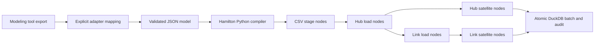

# Hamilton Vault

A runnable, metadata-driven Data Vault starter inspired by dbtVault (AutomateDV).
It creates and incrementally loads hubs, links, and ordinary satellites in DuckDB.
Apache Hamilton executes a generated dependency graph; JSON metadata replaces
per-table dbt models and macro calls. This is an independent reference implementation,
not a dbtVault replacement or a hash-compatible port.

## Run

Python 3.10+:

```sh
python -m venv .venv
source .venv/bin/activate
pip install -e '.[test]'
hamilton-vault validate examples/model.json
hamilton-vault compile examples/model.json --output examples/generated_dag.py
hamilton-vault run examples/model.json --database demo.duckdb --batch-id sales-001 --load-dts 2026-01-01T00:00:00Z
pytest -q
```

The initial load inserts 2 customer hubs, 3 order hubs, 3 links, 2 customer
satellites and 3 order satellites. Repeat the same run to see `already_loaded`.
For a new snapshot, change both Alice rows from Zurich to Bern in `sales.csv`,
then run with `--batch-id sales-002 --load-dts 2026-01-02T00:00:00Z`.
Only one new customer satellite record is inserted. Reverting to Zurich in a
third batch creates another history record: comparison is against the latest
state, not every hash ever seen.

CSV paths resolve relative to the model JSON, not your shell directory.
Generated code is inspectable; `run` compiles the current validated metadata in
memory and executes it, so there is no stale generated-code dependency.

## Architecture



| dbtVault concept | This implementation |
|---|---|
| stage model | One Hamilton `stage_*` node per CSV source |
| hub macro | Entity with `kind: hub` and ordered business `keys` |
| link macro | Entity with ordered, named hub `roles` |
| satellite macro | Entity with `parent` and ordered `attributes` |
| hash key/hashdiff | SHA-256 over canonical JSON arrays |
| dbt dependency graph | Generated typed Hamilton functions |
| incremental materialization | Append-only loading in one transaction |
| run results | JSON insert counts and `_vault_batches` audit table |

## Metadata contract

See `examples/model.json` and `metadata.schema.json`. Generate the schema with:

```sh
hamilton-vault schema --version 1 --output metadata.schema.json
```

- `sources`: CSV path, record-source label, exact ordered column list.
- Hub: nonempty ordered `keys`; one source per hub in this starter.
- Link: two or more named `roles`, each referring to a hub and mapping source
  columns to that hub's business-key order. Repeated hub types are allowed for
  different roles. Referenced keys must be present in the loaded hub.
- Satellite: hub or link `parent`, same source as parent, nonempty ordered
  descriptive `attributes`.
- Names: lowercase identifiers. Unknown fields, missing references and incompatible
  entity definitions fail validation.

Business keys and descriptive values are strings, whitespace-trimmed; empty
strings become null. Case is preserved. Null business keys reject the batch;
nullable descriptive attributes are allowed. Amounts remain text in this starter.
SHA-256 inputs use JSON array framing to distinguish nulls and embedded separators.
Link hashes use hub hashes in declared role order; hashdiff uses attribute order.
This deliberately differs from AutomateDV's concatenation/normalization conventions.
Do not mix the resulting hashes into an existing dbtVault installation unchanged.

## Hackolade integration

Hackolade exports vary by target/version and do not automatically provide source
mappings or loading rules. No native export was supplied for this project.
The included adapter accepts a **normalized export envelope**, not arbitrary
Hackolade project files. It verifies exported entity names against an explicit
mapping and creates the same validated model as hand-authored JSON.

```sh
hamilton-vault import-hackolade examples/hackolade.normalized.json --mapping examples/hackolade.mapping.json --output examples/imported_model.json
hamilton-vault validate examples/imported_model.json
```

`hackolade.normalized.json` is a synthetic adapter fixture, not an actual vendor
export. Adapt the export's actual table/entity collection to `{"entities":
[{"name": "hub_customer"}, ...]}`. The sidecar mapping supplies DV semantics and
source columns. Unmapped exported entities are ignored; mapped-but-missing entities
fail. Other tools can emit the canonical JSON directly. The JSON Schema can be
used to model/validate this contract in schema-aware tooling.

## Correctness and operating limits

- A run creates tables, loads dependencies, and records audit results in a single
  transaction. Any validation/load failure rolls back all writes from that batch.
- Exact replay uses a batch ID, metadata/content fingerprints and timestamp.
  Reusing the ID with changed inputs fails. A new ID with unchanged data inserts
  zero vault rows and records a new audit entry.
- New batches require strictly increasing, timezone-aware load timestamps.
- One descriptive state per parent key per snapshot. Identical duplicate rows
  collapse; conflicting satellite states fail instead of choosing arbitrarily.
- Metadata changes after a successful load fail closed. Use an explicit external
  migration and adaptation of the runner's model-version policy, or a new database.
- Sources must be immutable while running; post-run fingerprints detect changes.
- Single local writer; CSV data and staged rows fit in memory. Row-wise inserts
  favor readability over warehouse throughput. No parallel connection sharing.
- No CDC event ordering, source-effective timestamps, deletes/tombstones,
  multi-active/effectivity satellites, PIT/bridge tables, ghost records, business
  vault rules, schema migrations, scheduler, or cloud deployment is implemented.
- Delivery here means populated raw-vault DuckDB tables and machine-readable run
  results. Production warehouse delivery needs a backend implementation, SQL
  pushdown, operational scheduling and deployment configuration.

To add a warehouse, preserve the contract/compiler and implement staging/loading
and transaction/audit behavior for that warehouse. Simply replacing the connection
is insufficient because SQL dialects and transaction semantics differ.

## Project layout

- `vault/metadata.py`: strict contract and modeling-tool adapter.
- `vault/compiler.py`: readable Hamilton function generation.
- `vault/runtime.py`: hashing, staging, hub/link/satellite loads.
- `vault/runner.py`: Hamilton execution, transaction and batch audit.
- `vault/cli.py`: validate, compile, run, schema, import commands.
- `tests/test_vault.py`: initial load, replay, unchanged load, change/reversion,
  rollback, invalid keys, chronology, metadata drift, hashing and adapter tests.

## References

- Apache Hamilton driver: https://hamilton.apache.org/concepts/driver/
- AutomateDV loading: https://automate-dv.readthedocs.io/en/latest/best_practises/loading/
- AutomateDV hashing: https://automate-dv.readthedocs.io/en/latest/best_practises/hashing/
- Hackolade export: https://hackolade.com/help/Exportorforward-engineer.html
