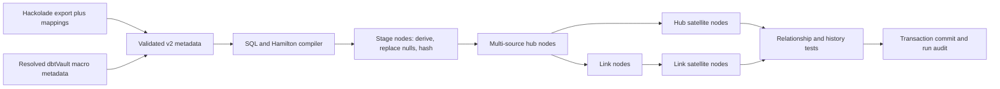

# Hamilton Vault — dbtVault-style replacement core

Define raw-vault loading with metadata, compile to SQL and a Hamilton DAG, and
execute without dbt. Version 2 implements the core `stage`, `hub`, `link`, and
ordinary `sat` patterns using familiar AutomateDV/dbtVault parameter names.

**Executable backend: DuckDB.** This is a working core replacement for these
patterns on a new DuckDB vault, not a complete replacement for every AutomateDV
macro, dbt project, or warehouse adapter. See [COMPATIBILITY.md](COMPATIBILITY.md)
before migrating an existing vault. Original version 1 projects still run with
their original hashing and loader; see [LEGACY_V1.md](LEGACY_V1.md).

## Quick start

Python 3.10+:

```sh
python -m venv .venv
source .venv/bin/activate
pip install -e '.[test]'
export HAMILTON_TELEMETRY_ENABLED=false

hamilton-vault validate examples/replacement/project.json
hamilton-vault build examples/replacement/project.json \
  --output build --load-dts 2026-01-05T00:00:00Z
hamilton-vault run examples/replacement/project.json \
  --database demo.duckdb --batch-id demo-001 \
  --load-dts 2026-01-05T00:00:00Z --result-file run_results.json
hamilton-vault test examples/replacement/project.json --database demo.duckdb
pytest -q
```

First run: **3 customer hubs, 2 order hubs, 2 links, 4 customer satellite rows,
3 order satellite rows**. Repeating the identical batch returns `already_loaded`.
Changing only the batch ID loads no additional vault rows and creates a new
audit entry. Reusing an ID with different inputs fails.

The CRM fixture contains Zurich → Bern → Bern → Zurich. The satellite retains
Zurich → Bern → Zurich; an unchanged state is suppressed, while a reversion is
preserved. ERP supplies an additional customer absent from CRM, demonstrating
one hub populated by multiple sources. Order history includes source-effective
timestamps independently of load timestamps.

## Architecture



Hamilton schedules dependencies. DuckDB performs set-based inserts and window
operations; Python does not loop over business records. All target writes and
the successful run audit commit together. Failure rolls back the batch.

## Project metadata

The complete example is [examples/replacement/project.json](examples/replacement/project.json).
A model looks like this:

```json
{
  "name": "sat_customer",
  "kind": "sat",
  "source_model": "crm",
  "src_pk": "CUSTOMER_HK",
  "src_hashdiff": "CUSTOMER_HASHDIFF",
  "src_payload": ["NAME", "CITY"],
  "src_ldts": "LOAD_DTS",
  "src_source": "RECORD_SOURCE",
  "parent": "hub_customer"
}
```

- `stages`: declared CSV headers, derived columns, null replacements and hashes.
- `models`: `hub`, `link`, or `sat`, with `src_*` parameters and dependencies.
- `source_model`: one stage name, or an ordered list for hubs/links. All stages
  must provide the same output aliases; derive aliases for differently named sources.
- `references`: link foreign-key column → hub model. `parent`: satellite hub/link.
- `src_eff`: optional source-effective timestamp; it is carried as data and is
  not the history ordering field. History follows `src_ldts`.
- `src_extra_columns`: audit/descriptive fields carried to the target.
- `late_arriving`: `error` by default; `ignore` explicitly filters records at or
  before the existing per-key latest load timestamp.

Identifiers may be uppercase or lowercase but must be unambiguous and valid.
Metadata is strict: unsupported fields fail. CSV paths are relative to the
project JSON. JSON is the supported configuration format; arbitrary YAML/Jinja
and SQL expressions are not executed.

Generate an editor/tooling schema:

```sh
hamilton-vault schema --version 2 --output project.schema.json
```

## Stage rules and hashing

Derived columns use one of `{"column":"RAW_NAME"}`, `{"literal":"CRM"}`, or
`{"load_timestamp":true}`. Column references point to raw columns. Optional
`transform` is `identity`, `trim`, `upper`, or `lower`. Null replacements are
explicit alias → replacement-string mappings, applied after derivation.

Hashes use normalized strings: trim spaces, optionally uppercase, and map empty
strings to null. Key hash input order is explicit. Hashdiff lists sort aliases
case-insensitively. Multi-column hashing uses configurable `||` and `^^` defaults.
All-null composite keys become null; hashdiff lists retain null placeholders.
Scalar and one-element-list hash definitions intentionally have different null
semantics, matching the documented macro conventions.

Defaults are MD5 and binary storage; SHA-256, hex storage, and disabled uppercase
normalization are available. Original payload and natural-key values are preserved
unless a stage rule transforms them. See the compatibility guide for limits on
cross-platform hashes, Unicode, null markers, and type casting.

## Compiled deliverables

`build` writes:

- `generated_dag.py`: ordinary typed Hamilton functions.
- `stages/*.sql`: CSV staging, derived fields, hashing, timestamp checks.
- `models/*.sql`: DDL, input preparation, checks and incremental inserts.
- `manifest.json`: model lineage, columns, types, checks and metadata fingerprint.
- `project.schema.json`: machine-readable metadata contract.
- `run.sql`: ordered SQL for inspecting or executing against a **scratch** DuckDB.

Regenerate SQL after moving the project: exported CSV paths are absolute and the
requested run timestamp is embedded. `run` recompiles from current metadata.
The standalone SQL includes data checks but bypasses Python's ownership policy,
exact CSV-header check, physical-schema checks, source-file fingerprints and run
audit. Use the CLI/Hamilton runner for managed loads. If manually executing SQL
fails, explicitly roll back the open transaction.

## Importing modeling and dbtVault metadata

```sh
hamilton-vault import-automatedv examples/replacement/automatedv.export.json \
  --output examples/replacement/imported_project.json
hamilton-vault import-hackolade examples/replacement/hackolade.normalized.json \
  --mapping examples/replacement/project.json \
  --output examples/replacement/imported_hackolade.json
```

The first adapter consumes a documented JSON **resolved macro export**, not dbt's
native `manifest.json`. It maps `automate_dv.hub`/`dbtvault.hub` (and link/sat),
`!constant` derived values, hash arguments and selected project variables.
The fixture shows the entire export contract. Unsupported expressions/macros fail.

The second adapter checks modeling-tool entity names against an explicit sidecar
project. The fixture is synthetic and normalized; a native Hackolade export needs
its target-specific entity collection normalized first. Neither adapter guesses
business keys, source-to-target mappings, or load rules from table names.

## Operating behavior

- Earliest source load timestamp wins for new hub/link keys; ties use the declared
  source order, then output values for reproducibility. Existing hubs/links remain
  append-only. Null key/FK rows are excluded and counted in run results.
- Satellites accept multiple chronological states per key per batch. Identical
  duplicates collapse; conflicting states at one load timestamp reject the batch.
- Recognized historical states replay harmlessly. Unseen changes before the latest
  stored timestamp fail by default; late-source filtering is an explicit choice.
- Hub business-key and link relationship conflicts for one hash reject the batch.
- Parent existence, uniqueness, required fields and consecutive satellite history
  checks run in the transaction. `test` rechecks persisted data and table schemas.
- Load/effective timestamps require explicit timezone suffixes. DuckDB sessions
  use UTC; consumers should set their display timezone deliberately.
- `_hv_project` binds the database to a project, metadata fingerprint and engine
  version; `_hv_runs` records successful batches, counts and tests. Failed loads
  raise an error and have no success audit row.
- Model/engine changes and unmanaged pre-existing target tables fail closed.
  There is no automatic schema migration, adoption or destructive full refresh.
- Sources must remain immutable for a run; content fingerprints are checked before
  and after execution. One project and one writer per DuckDB database.

The loader is SQL-first but has not been benchmarked for production scale. There
is no Snowflake/Databricks backend, scheduler, CDC connector, or cloud deployment.

## Code map

| File | Responsibility |
|---|---|
| `vault/v2/metadata.py` | Validated stage and model contracts |
| `vault/v2/sql.py` | Hashing, staging, loading and data-test SQL |
| `vault/v2/engine.py` | Hamilton DAG, transactions, schema checks, audit, build |
| `vault/v2/importers.py` | Explicit modeling-tool and resolved macro adapters |
| `vault/cli.py` | CLI and v1/v2 routing |
| `tests/test_replacement.py` | Hash vectors and SQL-first integration scenarios |
| `tests/test_vault.py` | Original v1 regression tests |

`requirements-tested.txt` records the local validation environment. The package's
`pyproject.toml` declares supported dependency ranges.
